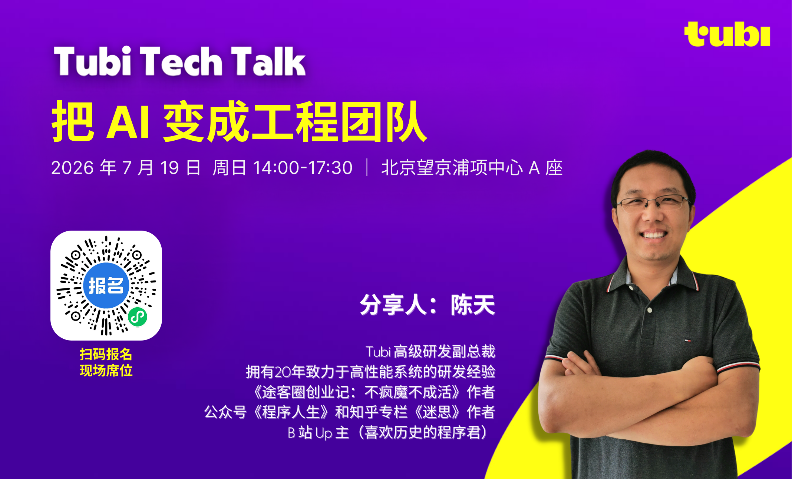
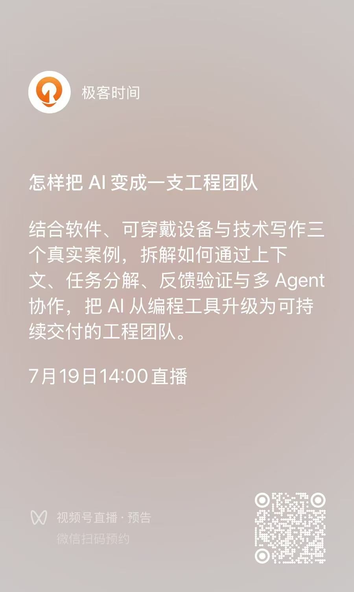

# Tubi Meetup：怎样把 AI 变成一支工程团队

如果代码的生成成本继续下降，工程师最值钱的能力还会是写代码吗？如果一个人可以同时调度多个 Agent，团队会变小，还是会承担更大的系统？当实现速度不再是瓶颈，我们又该怎样规划自己的下一段职业生涯？

过去两年，我们谈论 AI 编程时，常常把注意力放在一个很窄的问题上：怎样写出更好的 Prompt，怎样让 ChatGPT、Claude Code、Codex 或 Cursor 更快地产生代码。但当 AI 真正进入一个持续数月、跨越多个模块、最终必须交付的项目后，决定成败的往往不是某一次对话有多精彩，而是项目是否拥有一套稳定的工程系统。

这也是我准备在本周 Tubi Meetup 分享的主题：**把 AI 变成工程团队**。

这场讲座不会演示“输入一句话，生成一个应用”的魔术。它会从三个真实而且差异很大的工程案例出发：一个轻量的 Rust AWS 本地模拟器、一套从球鞋上的传感器延伸到云端机器学习的可穿戴设备，以及若干本 400—600 页、能够自动构建和发布的中文技术书。三个案例分别属于纯软件、软硬件和知识内容世界，却逐渐指向同一个结论：

> AI 原生工程不是 Prompt Engineering，而是围绕 AI 构建可执行的上下文、任务分解、反馈验证和交付系统。

## 写得更快，不等于交付得更快

传统工程流程通常被描述为理解需求、设计、编码、调试和测试。AI 大幅压缩了其中的实现成本，但它没有自动消除架构取舍、质量责任和事实验证。相反，当代码和文字能够以过去数倍甚至数十倍的速度产生时，模糊的需求、不稳定的接口和缺失的测试也会以同样的速度被放大。

因此，工程师的工作正在发生迁移：从亲手完成每一个实现细节，转向定义问题、写清约束、设计验证方法、分解和调度任务、审查 AI 产物，并处理那些无法被模板覆盖的例外与未知。

我把 AI 工程产能概括为一个乘法公式：

**模型能力 × 上下文质量 × 任务分解 × 反馈速度 × 验证强度 × 人的判断。**

它之所以是乘法，是因为任何一项接近零，整个系统都可能失效。再强的模型，如果不知道项目的长期规则，也只能反复猜测；再完整的 Spec，如果没有快速测试和外部反馈，也无法阻止一个“看起来合理”的错误逐渐扩散。

## 构建协议型软件系统

第一个案例 Rustack，是一个参考 localstack，使用 Rust 构建的轻量 AWS 本地模拟器。目前项目覆盖 18 个服务、779 个路由操作，启动时间不到一秒，Docker 镜像约 8 MB。

它面对的难题并不是写出几个 CRUD Handler，而是协议广度和兼容性。AWS SDK 关心请求签名、HTTP 路由、XML 或 JSON 序列化、错误模型以及大量细微的行为语义。一个接口“能够返回结果”，不代表它与真实客户端兼容。

Rustack 没有从铺满所有服务开始，而是先选择 S3 作为纵向切片：客户端请求经过签名校验、协议解析、业务逻辑和存储，最后产生 SDK 能够理解的响应。S3 足够复杂，会暴露 XML、SigV4、流式数据、对象版本和 Multipart 等问题；同时它拥有成熟的 SDK 和第三方兼容性测试，可以为 AI 提供机器可读的失败信号。

这个过程逐渐形成三层项目上下文。`AGENTS.md` 保存长期不变的工程规则，例如错误处理、并发模型、质量门禁和“不能留下 TODO”；Skills 保存可重复执行的工作流程；Specs 则约束当前功能的数据模型、组件关系、边界条件和退出标准。Prompt 是一次性的，而这些上下文可以版本化、Review，并随着项目一起演进。

更重要的是，外部测试会成为 AI 最好的教师。DynamoDB 的实现最初可能拥有“看起来正确”的增删改查，但 Alternator 测试会进一步揭示表达式优先级、精确数值、嵌套路径、返回值、分页限制和参数校验顺序。三轮集中修复之后，Rustack 通过了当时纳入回归的 457 个选定用例。这个数字不是 DynamoDB 的完整功能覆盖率，却给出了一个边界清楚、可以复现的工程事实：每个失败都能转化成具体的语义差距、回归测试和规格修正。

## 和 AI 一起打造软硬件全栈系统

第二个案例进入软硬件系统：在球鞋上安装传感器，采集足球运动中的加速度、转向、跑动和触球相关数据，通过手机或场边设备接收，再由云端完成处理和个性化分析。

“做一个足球传感器”并不是可执行的需求。真正能够驱动工程工作的，是重量、体积、续航、采样频率、传输延迟、通信距离、并发设备数、防水抗冲击和数据完整性等约束。

AI 在项目早期非常适合帮助软件工程师快速建立领域地图：从用户目标推导物理量，从物理量推导传感器、采样和计算，再延伸到通信、移动端、云端和机器学习。但 MCU（微控制器）、IMU（惯性测量单元）、GNSS（全球卫星导航系统）、BLE（低功耗蓝牙） 和电源管理方案都只能被视为候选假设。最终答案必须回到 Datasheet、Reference Design、开发板、电流分析仪、射频测试和真实运动数据。

这类项目必须同时设计硬件、固件、移动端、云端控制平面和数据管线。最有效的并行方式，不是等待 PCB 完成后再写 App，而是先稳定数据契约：设备 ID、Session、序列号、时间戳、采样率、传感器值、电池、固件版本和质量标志如何表达；丢包怎样发现；两只鞋和手机怎样进行时间对齐；协议如何向前演进。

在硬件到手之前，还可以用软件生成正常、丢包、乱序、时钟漂移和多人并发的模拟数据流。Rust 解析核心、iOS Session、云端入口和可视化可以先围绕这个“数字替身”运行起来。等真实设备接入时，面对的就不再是一个完全未知的系统边界。

然而，这个案例最重要的提醒仍然是：AI 的输出只是可验证的工程假设。平均功耗不能通过简单相加得到，BLE 标称距离不等于鞋内和人体遮挡下的现场距离，IMU 看起来靠谱的数据也可能包含偏置、温漂和时钟漂移。软件依靠测试，硬件最终依靠测量。

## 构建长期一致的知识系统

第三个案例是使用 AI 写一本 400—500 页的技术书。大家或多或少已经适应用 AI 写文档，博客，邮件等一次性的长内容。但如何构建一本书呢？它的难点不在于生成一段流畅文字，而在于几十万字如何保持事实、结构、术语和文风的一致性。

写书和软件工程有许多对应关系：读者契约类似 PRD，全书主线类似系统架构，术语与概念契约类似 API，知识脉络类似依赖图，事实核查和文风检查类似测试与 Lint，而 Typst/PDF 构建和 GitHub Release 则对应 Build 与 Release。

Agent 不需要在上下文里“记住整本书”。真正重要的约束可以进入仓库：每本书拥有自己的写作契约、全书计划、章节计划、研究材料、Review 记录、插图和构建输出。写作契约明确目标读者、叙事立场、公式和类比的使用方式，也明确哪些表达属于 AI 腔、翻译腔或讲义腔。

一章内容也不是一个 Prompt 直接完成的。更可靠的流程是：全书规划、章节规划、研究问题、资料汇编、初稿、技术审查、结构审查、文风审查、事实核查、图表制作、排版渲染和最终人工审校。研究与写作分离，可以降低“合理但不存在”的事实混入正文；独立审查则帮助发现每一章单看都不错、合起来却没有主线的问题。

实践中的成本也值得诚实呈现：一本 400—500 页的书，Agent 工作至少约 25 小时，可能消耗 40%—50% 的 Codex Pro 周额度，人工仍然需要约 5—10 小时进行粗审、校对和工作流优化。AI 没有把出版变成一键生成，它只是把数月的重复劳动压缩成几十小时的 Agent 执行，并把人的注意力移动到主线、取舍、事实、文风和最终责任上。

## 三个项目背后的共同方法

Rustack 的最终验证者是测试、兼容性套件和 Benchmark；可穿戴设备的最终验证者是仪器、实物和现场数据；技术书的最终验证者是来源、审稿和读者理解。验证方法不同，工程循环却高度一致：

**意图 → 约束 → 规格 → 任务拆分 → 执行 → 验证 → 独立审查 → 产物与项目记忆。**

每一次失败都不应该只在当前对话里被临时修复。它应该被写回测试、规格、工作方法或工程规则，让下一次执行从更高的起点开始。仓库能够记住团队学到的东西，项目才会越做越顺。

## AI 时代，工程师的未来

讲座的最后一个主题会把视角从项目拉回工程师自身。AI 不只提高编码速度，它正在改变软件的生产单位。代码、提交和合并请求能说明发生了工作，却不能证明问题已经解决。更值得衡量的是“经过验证的新能力”：从需求、设计和实现，一直到测试与运行证据。

这也意味着团队必须重新决定一项任务可以交给 Agent 多远。判断不该只看“模型会不会做”，还要同时看两件事：机器能否独立验证结果，失败会造成多大影响。容易验证、失败影响较小的任务，可以让 Agent 独立执行；容易验证但后果严重的任务，可以自动执行、人工批准；难以验证且后果严重的任务，仍然需要人来定方向并随时接管。

团队不会因为 Agent 出现就自动消失，但协作方式会改变。人负责方向、权限、取舍和异常升级，不同 Agent 承担研究、规格、实现、测试与审查，真实用户和生产环境继续提供最终反馈。实现可以委托，解释关键决策、识别未知、接管失败和承担后果的责任不会随之转移。

对个人而言，值得长期练习的能力可以分成四层。最底层是熟练使用模型和工具；再向上是系统设计与领域理解；然后是验证能力与责任；最上层是问题选择与工程品味——知道什么值得做，什么结果足够好，以及什么时候必须停下来重新定义问题。工具层最容易学习，也最容易被复制；越往上，越需要真实项目中的长期实践。

现场还会给出一份可以检查结果的 30／90／365 天行动计划。前 30 天，选择一个每周都会重复、失败可以复现的任务，记录当前耗时和返工，并跑通第一个自动验收闭环。前 90 天，让 Agent 贯穿研究、规格、实现、测试与审查，把至少十次有效修正写回项目，交付一个真实用户正在使用的端到端能力。一年内，在一个领域积累可复用的规格、评估集和工作方法，设计好权限、审查与异常接管路径，并对质量、成本、运行结果和用户后果负责。

## 本周日，Tubi Meetup 现场见

如果你已经在使用 Codex、Claude Code、Cursor 等工具，但仍然觉得 AI 只能承担零散任务；如果你正在思考怎样让 Agent 参与长期项目、跨团队协作或软硬件开发；或者你关心技术管理者和架构师在 AI 时代的新职责，欢迎来参加这次 Tubi Meetup。

活动时间为 **2026 年 7 月 19 日（本周日）14:00—17:30**。现场会完整展开三个案例、统一方法论与“工程师的未来”主题，并穿插现场演示。

参与现场活动的同学，请扫以下二维码在活动行里进行报名。

观看线上直播的同学，可以扫描以下二维码登录极客时间进行观看。

这不是一场关于“让 AI 多写一点代码”的分享，而是一次关于如何重新组织工程工作的讨论。

当实现变得廉价，定义问题、建立反馈和判断质量，正在成为工程师最昂贵的能力。期待本周日下午在 Tubi Meetup 与大家见面。
